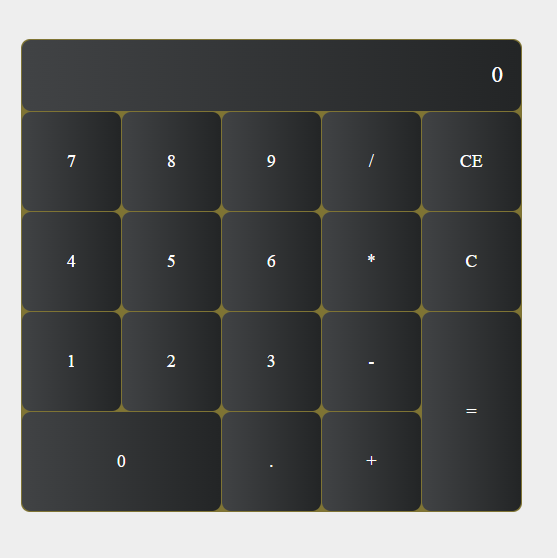

# Calculator Project

This is a simple calculator application built using HTML, CSS, and JavaScript. It provides basic arithmetic operations and a clean, user-friendly interface.

---

## Features
- **Responsive Design**: Works seamlessly across different screen sizes.
- **Basic Operations**: Addition, subtraction, multiplication, and division.
- **Utility Functions**: Clear (`C`) and backspace (`CE`) functionality.
- **Interactive Buttons**: Stylish and visually appealing user interface.

---

## Technologies Used
- **HTML**: For the structure of the application.
- **CSS**: For the styling and layout.
- **JavaScript**: For calculator functionality and interactivity.

---

## How to Run
1. Clone this repository:
   ```bash
   git clone https://github.com/your-username/calculator.git
   ```
2. Navigate to the project folder:
   ```bash
   cd calculator
   ```
3. Open `index.html` in any web browser to run the application.

---

## File Structure
```
calculator/
│
├── index.html      # Main HTML file
├── style.css       # CSS for styling the calculator
├── script.js       # JavaScript functionality
├── .gitignore      # Files to ignore
└── README.md       # Project documentation
```

---

## Demo



---

## Contributing
Contributions are welcome! To contribute:
1. Fork the repository.
2. Create a new branch:
   ```bash
   git checkout -b feature-name
   ```
3. Commit your changes:
   ```bash
   git commit -m "Add feature-name"
   ```
4. Push your branch:
   ```bash
   git push origin feature-name
   ```
5. Open a pull request.


